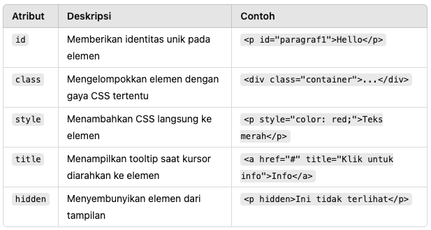
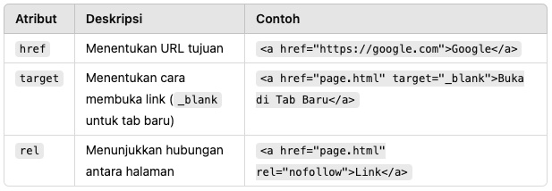
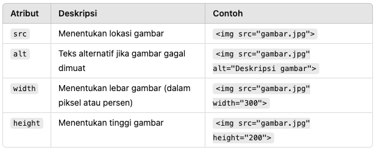
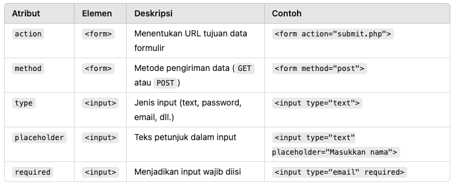
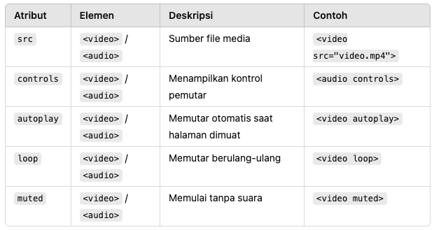

### Apa Itu Atribut dalam HTML?

Atribut dalam **HTML** adalah **informasi tambahan** yang diberikan pada elemen untuk mengontrol perilaku atau tampilannya. Atribut selalu ditempatkan dalam **tag pembuka** dan memiliki format:

### 1. Atribut Global

Atribut ini dapat ditambahkan ke hampir semua elemen HTML.

### 2. Atribut pada Elemen Tautan (`<a>`)

### 3. Atribut pada Gambar (``)

### 4. Atribut pada Formulir

### 5. Atribut pada Media (`<video>` dan `<audio>`)

