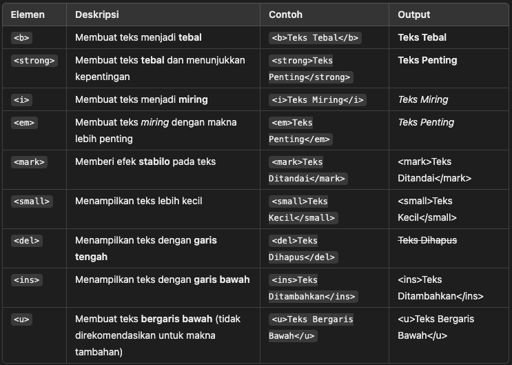

### **Apa Itu HTML Formatting Elements?**

HTML Formatting Elements adalah elemen yang digunakan untuk memberikan **format khusus** pada teks, seperti  **teks tebal, miring, bergaris bawah, bergaris tengah, dan lain-lain** . Elemen-elemen ini membantu menyoroti bagian penting dari teks di halaman web.


## **Macam-Macam HTML Formatting Elements**

#### **1. Elemen untuk Menyoroti Teks**



#### 2. Elemen untuk Menampilkan Kode atau Kutipan


```
Kutipan ini sangat penting. | | <q> | Menampilkan kutipan pendek dalam tanda kutip | <q>Ini kutipan</q> | "Ini kutipan" | | <abbr> | Menampilkan singkatan dengan tooltip saat dihover | <abbr title="HyperText Markup Language">HTML</abbr> | HTML (saat hover: "HyperText Markup Language") | | <cite> | Menampilkan judul buku/film dalam format miring | <cite>Web Development Guide</cite> | Web Development Guide | | <dfn> | Menampilkan definisi istilah dalam format miring | <dfn>HTML</dfn> adalah bahasa markup. | HTML adalah bahasa markup. |
```

#### 3. Elemen untuk Mengontrol Teks dan Spasi


```
<p><b>Ini teks tebal</b> dan <strong>ini teks tebal dengan makna penting</strong>.</p>
    <p><i>Ini teks miring</i> dan <em>ini teks miring yang menekankan makna</em>.</p>
    <p><mark>Ini teks yang ditandai (highlight).</mark></p>
    <p><del>Ini teks yang dicoret</del>, <ins>ini teks yang ditambahkan</ins>, dan <u>ini teks bergaris bawah</u>.</p>

    <p>Rumus kimia air adalah H<sub>2</sub>O, sedangkan 10<sup>2</sup> = 100.</p>

    <p><blockquote>"Ini adalah kutipan panjang."</blockquote></p>

    <p><q>Ini adalah kutipan pendek dalam teks.</q></p>

    <p>Kata <abbr title="HyperText Markup Language">HTML</abbr> adalah singkatan dari HyperText Markup Language.</p>

```
